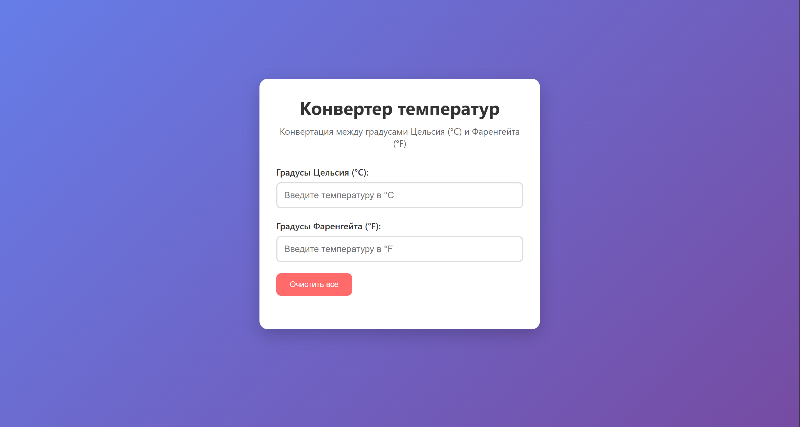
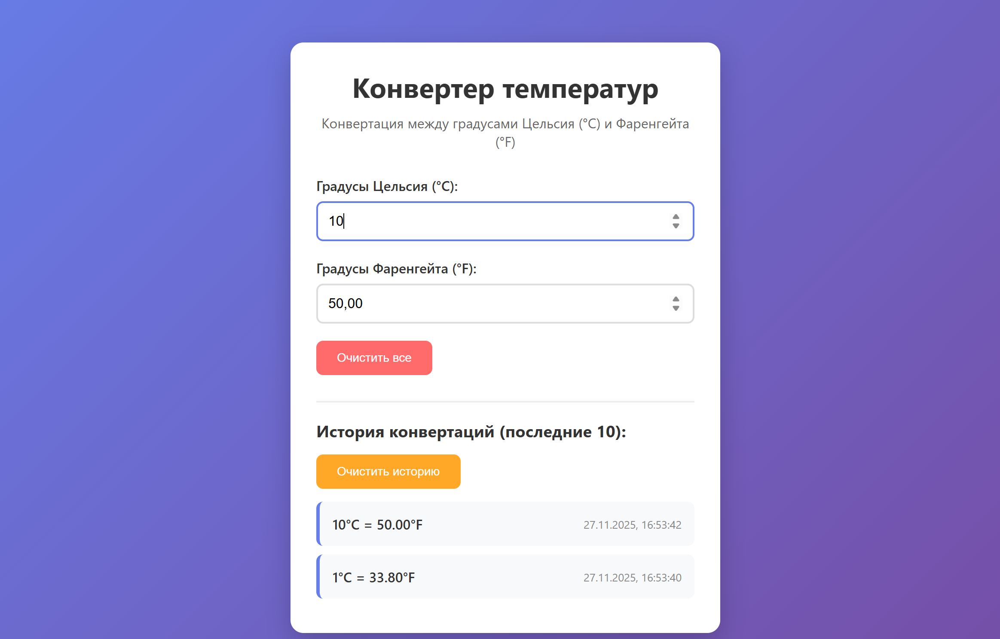
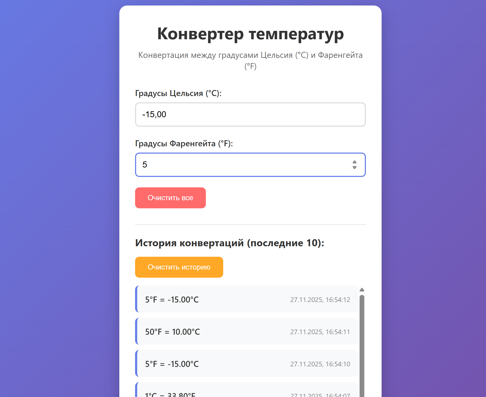
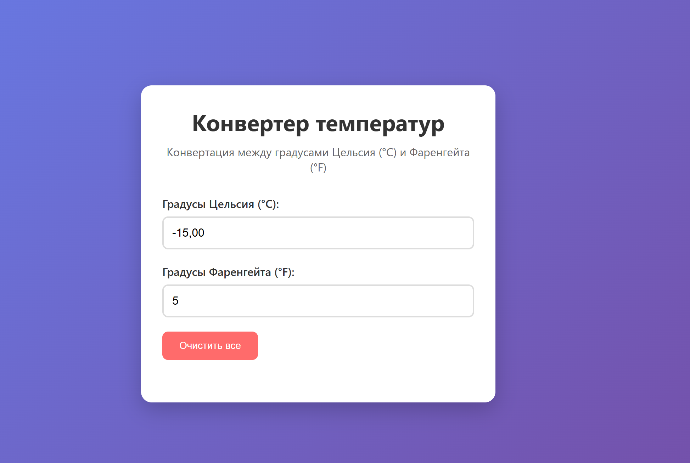

# Конвертер температур

React-приложение для конвертации температур между градусами Цельсия (°C) и Фаренгейта (°F).

## Функциональность

- Конвертация °C в °F и обратно
- Автоматический расчет при вводе
- История конвертаций
- Локальное сохранение данных

## Установка и запуск

npm install
npm start

## Скриншоты
Главный экран приложения
 

Пример конвертации
 

История конвертаций
 

Очистка данных
 

## Отчёт
Разработанное приложение представляет собой конвертер температур, позволяющий осуществлять взаимный перевод между градусами Цельсия (°C) и Фаренгейта (°F). Приложение обладает интуитивно понятным интерфейсом и расширенным функционалом.
- **Двусторонняя конвертация** - автоматический пересчет значений при вводе в любое поле
- **История операций** - сохранение последних 10 конвертаций с временными метками
- **Локальное хранение** - данные сохраняются в localStorage браузера
- **Адаптивный дизайн** - корректное отображение на различных устройствах
- **Очистка данных** - возможность сброса полей ввода и истории
Приложение построено на функциональных компонентах React с использованием хуков:
- `TemperatureConverter` - основной компонент с бизнес-логикой
- `App` - корневой компонент приложения